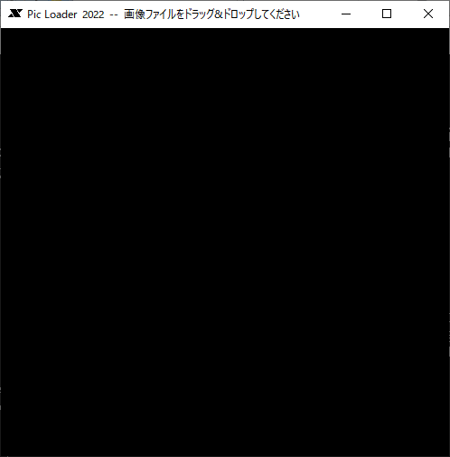

# PicLoader2022
Java(Swing)で動作する柳沢PIC形式の画像ローダーです。
PIC形式の画像を表示させることができます。
稲妻走ります。

## 柳沢PIC形式について
柳沢PIC形式はX68000で使われた画像圧縮形式です。
以下の記事が参考になると思います。
- Wikipedia の [PIC](https://ja.wikipedia.org/wiki/PIC_(%E7%94%BB%E5%83%8F%E5%9C%A7%E7%B8%AE))
- Qiita [Unityで柳沢PIC形式の画像を読込む](https://qiita.com/tomotaco/items/705f79ae59368417aef8)

原作者である、やなぎさわ氏( http://www.vector.co.jp/vpack/browse/person/an001322.html )により、PICフォーマット仕様書が Vector で公開されています( http://www.vector.co.jp/soft/data/art/se003198.html )。

本プログラムでの画像読み込み処理は、これに同梱された「PICの説明のオマケのローダー」と位置づけされる picl.c に基づきます。

## 使用方法
### 起動と画像の表示
プログラムを以下のコマンドラインで起動します(または、 関連付けしてあれば jar のダブルクリックでも起動すると思います)。
```
java -jar picloader2022.jar
```

ウィンドウが開くので PIC画像形式のファイルをドラッグドロップします。
画像の読み込みが行われると思います。



### マウス操作
ウィンドウ内部の表示域を左クリックすると、画面サイズが変更します。
| 拡大モード  | 拡大方法                             |
--------------|--------------------------------------
| 1           | 512 × 512 等倍                      |
| 2           | 512 × 512 を 2 × 2 ドットで拡大    |
| 3           | 512 × 512 を 3 × 2 ドットで拡大    |

### その他の操作
起動してから終了するまでの間、読み込んだファイル名の履歴を覚えています。
再表示をさかのぼること、複数のを順番に見ることができます。

| 入力キー    | 操作                                                                    |
--------------|-------------------------------------------------------------------------
| S           | 画面の拡大モードを 1 → 2 → 3 の順に切り替えます。                     |
| SHIFT + S   | 画面の拡大モードを 3 → 2 → 1 の順に切り替えます。                     |
| ←          | 一つ前に読み込んだ画像を表示します。繰り返すと履歴をさかのぼります。    |
| SHIFT + ←  | 最初に読み込んだ画像を表示します。                                      |
| →          | 「一つ後の画像」を表示します。                                          |
| SHIFT + →  | 最後に読み込んだ画像を表示します。                                      |
| R           | 画像を再度読み込みます                                                  |
| C           | いま表示している画像を履歴からクリアします                              |
| D           | 画像の読み込みの履歴をすべてクリアします                                |
| N           | 画像の読み込みをノーウェイトで行うよう切り換えます(トグル動作)。        |
| スペース    | 表示中の読み込み処理があればウェイト処理を打ち切ります。 表示済の場合次の画像を表示します。 |
| Q           | 終了します。                                                            |

## このプログラムについて
### PICの読み込み処理
原作者、やなぎさわ氏( http://www.vector.co.jp/vpack/browse/person/an001322.html )によるPICフォーマット仕様書( http://www.vector.co.jp/soft/data/art/se003198.html )に同梱された「PICの説明のオマケのローダー」と位置づけされる picl.c に基づきます。

基本的にはCで書かれたものをほぼそのままJavaにベタで書き写しています。
以下の作り込みとかはしてます。
- picl.cはX68000のGVRAMにアクセスする作りになっているので、それを代替するようなバッファを作成
- ロード時、稲妻に形容される模様が画面上に表れるよう、あえてゆっくり読み込むように作り込み

### ウィンドウアプリケーションとしての動作
Swingで適当に作っていて、読み込み済ファイルの履歴を持っていて再表示するとかの作り込みだけしています。
複数のファイルをドラッグドロップしたときに、ファイル数だけローダーのオブジェクトを作成し、資源を野放図に使ってしまう作りが気になるのですが、いったんこのまま放置します。

### その他
jarの再作成は、Windows環境であれば以下のコマンドラインで行います。

```
jar cfm ..\picloader2022.jar ..\META-INF\manifest.mf com\github\novisoftware\pic2022\picLoader\*.class com\github\novisoftware\pic2022\viewer\*.class com\github\novisoftware\pic2022\viewer\*.png
```
