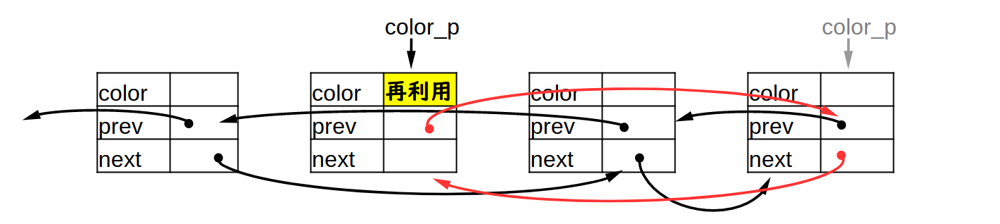
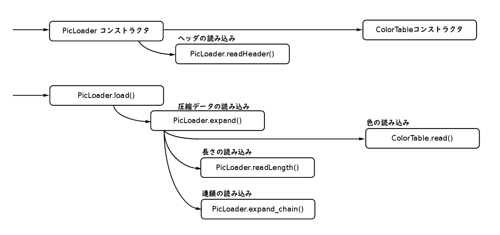

# PicLoader2022
Java(Swing)で動作する柳沢PIC形式の画像ローダーです。
PIC形式の画像を表示させることができます。
稲妻走ります。

## 柳沢PIC形式について
柳沢PIC形式はX68000で使われた画像圧縮形式です。
以下の記事が参考になると思います。
- Wikipedia の [PIC](https://ja.wikipedia.org/wiki/PIC_(%E7%94%BB%E5%83%8F%E5%9C%A7%E7%B8%AE))
- Qiita [Unityで柳沢PIC形式の画像を読込む](https://qiita.com/tomotaco/items/705f79ae59368417aef8)

原作者である、やなぎさわ氏( http://www.vector.co.jp/vpack/browse/person/an001322.html )により、PICフォーマット仕様書が Vector で公開されています( http://www.vector.co.jp/soft/data/art/se003198.html )。

本プログラムでの画像読み込み処理は、これに同梱された「PICの説明のオマケのローダー」と位置づけされる picl.c に基づきます。

## 使用方法
### 起動と画像の表示
jarディレクトリの中の picloader2022.jar を使います。
以下のコマンドラインでプログラムを起動します(または、 関連付けしてあれば jar のダブルクリックでも起動すると思います)。
```
java -jar picloader2022.jar
```

ウィンドウが開くので PIC画像形式のファイルをドラッグドロップします。
画像の読み込みが行われると思います。


### マウス操作
ウィンドウ内部の表示域を左クリックすると、画面サイズが変更します。
| 拡大モード  | 拡大方法                             |
--------------|--------------------------------------
| 1           | 512 × 512 等倍                      |
| 2           | 512 × 512 を 2 × 2 ドットで拡大    |
| 3           | 512 × 512 を 3 × 2 ドットで拡大    |

### その他の操作
起動してから終了するまでの間、読み込んだファイル名の履歴を覚えています。
再表示をさかのぼることや、複数の画像を順番に見ることができます。

| 入力キー    | 操作                                                                    |
--------------|-------------------------------------------------------------------------
| S           | 画面の拡大モードを 1 → 2 → 3 の順に切り替えます。                     |
| SHIFT + S   | 画面の拡大モードを 3 → 2 → 1 の順に切り替えます。                     |
| ←          | 一つ前に読み込んだ画像を表示します。繰り返すと履歴をさかのぼります。    |
| SHIFT + ←  | 最初に読み込んだ画像を表示します。                                      |
| →          | 「一つ後の画像」を表示します。                                          |
| SHIFT + →  | 最後に読み込んだ画像を表示します。                                      |
| R           | 画像を再度読み込みます                                                  |
| C           | いま表示している画像を履歴からクリアします                              |
| D           | 画像の読み込みの履歴をすべてクリアします                                |
| N           | 画像の読み込みをノーウェイトで行うよう切り換えます(トグル動作)。        |
| スペース    | 表示中の読み込み処理があればウェイト処理を打ち切ります。 表示済の場合次の画像を表示します。 |
| Q           | 終了します。                                                            |

## このプログラムについて
### PICの読み込み処理
原作者、やなぎさわ氏( http://www.vector.co.jp/vpack/browse/person/an001322.html )によるPICフォーマット仕様書( http://www.vector.co.jp/soft/data/art/se003198.html )に同梱された「PICの説明のオマケのローダー」と位置づけされる picl.c に基づきます。

基本的にはCで書かれたものをほぼそのままJavaにベタで書き写しています。
以下の作り込みとかはしてます。
- picl.cはX68000のGVRAMにアクセスする作りになっているので、それを代替するようなバッファを作成
- ロード時、稲妻に形容される模様が画面上に表れるよう、あえてゆっくり読み込むように作り込み

### ウィンドウアプリケーションとしての動作
Swingで適当に作っていて、読み込み済ファイルの履歴を持っていて再表示するとかの作り込みだけしています。
複数のファイルをドラッグドロップしたときに、ファイル数だけローダーのオブジェクトを作成し、資源を野放図に使ってしまう作りが気になるのですが、いったんこのまま放置します。

### その他
jarの再作成は、Windows環境であれば以下のコマンドラインで行います。

```
jar cfm ..\picloader2022.jar ..\META-INF\manifest.mf com\github\novisoftware\pic2022\picLoader\*.class com\github\novisoftware\pic2022\viewer\*.class com\github\novisoftware\pic2022\viewer\*.png
```

# PICデータフォーマット
PICデータフォーマットをやなぎさわさんの解説記事から抜粋転記します。

(「本資料の転載、引用すべて自由です（連絡不要）」との記載に甘え、かなり多めに引用しています。
図はテキストファイル中のAAを元に書き起こしました)


全体は以下で構成されます。
- ヘッダ
- 圧縮データ

## ヘッダ

|    データ    |   データ長      |       意味                |
---------------|-----------------|----------------------------
|      'P'     |   1byte         | ＰＩＣであることの印      |
|      'I'     |   1byte         |        〃                 |
|      'C'     |   1byte         |        〃                 |
|     $1A以外  | 任意byte        | コメント部                |
|     $1A(EOF) | 1byte           | コメントの終わりを示す    |
|       0以外  | 任意byte        | ダミー                    |
|       0      | 1byte           | 真のコメントの終わり      |
|       0      | 1byte           | 予約                      |
|       x      | 1byte           | bit 0..3 機種タイプ       |
|              |                 | bit 4..7 機種毎のモード   |
|       x      | 1word (2byte)   | 色のビット数              |
|       x      | 1word           | Ｘ方向のサイズ            |
|       x      | 1word           | Ｙ方向のサイズ            |
|       p      | nbyte           | パレットデータなど        |
|              |                 | 内容は機種／モード／色数によって変わります   |
|              |                 | (オリジナルは、ここは何もない)   |

オマケのローダーを元にしているため、機種タイプ／機種毎のモードは、0/0のみで動作します。
色のビット数は15のみで動作します(65536色の中で輝度ビットを使用しない、32768色)。

## 圧縮データ
圧縮データは以下のように繰り返します。


### 長さ
長さは以下に例示されるように符号化されます。

 | 表現する範囲 | 符号         |
----------------|---------------
 | 1～2 | 0X                   |
 | 3～6 | 10XX                 |
 | 7～14 | 110XXX              |
 | 15～30 | 1110XXXX           |
 | 31～62 | 11110XXXXX         |
 | 63～126 | 111110XXXXXX      |
 | 127～254 | 1111110XXXXXXX   |
 | 255～510 | 11111110XXXXXXXX |
 |    :     |        :         |

[ハフマン符号](https://ja.wikipedia.org/wiki/%E3%83%8F%E3%83%95%E3%83%9E%E3%83%B3%E7%AC%A6%E5%8F%B7)と通常の固定桁の2進符号化が組み合わされた独自の符号化だと思います。

### 色


#### 色キャッシュの考え方
以下は pic_fmt.txt から抜粋です(抜粋後、一部の文言をリンク化)。
> 同じ色は近所にあることが多いと言うことを利用して簡単なキャッシュをします。
> 具体的には過去128色分をテーブルに取って置き、次の色が来たときに既にその色がテーブル中にあれば、テーブル中に有るというフラグ＋テーブル中の位置を記録するようにして、テーブル中に無ければ、無いというフラグ＋色コードを記録するようにします。
> これで同じ色が頻繁に出てくる場合は、少ないビット数で済みます。

> またテーブルに無い色が出たときには、テーブルから最も古くに使用された色コードを捨てて代わりにこの新しい色をセットすることを行います。[LRU法](https://ja.wikipedia.org/wiki/Least_Recently_Used)ですね。

Javaに書き写した実装での該当箇所は [ColorTable.java](https://github.com/novisoftware/PicLoader2022/blob/main/src/com/github/novisoftware/pic2022/picLoader/ColorTable.java) です。

書き写した実装を見てみると、LRU処理は、配列添字による双方向ポインタ表現でしていて、キャッシュミス時、キャッシュヒット時のテーブルの変化は以下のようになります。

（キャッシュミス時）キャッシュされていない色を追加する動作では、テーブルは例えば以下のように変化します( ColorTable.getColor() )。


（キャッシュヒット時）キャッシュされている色を再利用する動作では、テーブルは例えば以下のように変化します( ColorTable.regColor() )。




色インデックス番号は0～127の範囲で使用され、「最近利用されたものほど番号が小さくなる」という性質はありません。
もしも仮にですが、色インデックス番号も符号化したとしたら、データサイズをさらに小さくすることができるのだろうか、とも想像してしまいますが、データサイズ vs 展開速度の兼ね合いや、当時存在した画像ファイルでのデータの性質、等々が考慮された結果だと思います。

### 連鎖


#### 連鎖の考え方
PICの圧縮は、ランレングス符号化（[連長圧縮](https://ja.wikipedia.org/wiki/%E9%80%A3%E9%95%B7%E5%9C%A7%E7%B8%AE)）の考え方を拡張したものです。
素のランレングス法は、1x1のドットの色が変わる位置までの長さを記録します。
PICでは色が変わるドット位置で、さらに連鎖形状を符号化します。
連鎖が符号化済の箇所は色が変化しないとして扱い、連長を長くし、変化点の数を劇的に減らすことができます(その場所の符号化をする必要がない)。

以下は pic_fmt.txt から抜粋です。
> まず圧縮には大きく分けて可逆（完全に元に戻るもの）と非可逆（見た目に問題な
> い部分を省略する）のものがあり、ＰＩＣは完全復元する前者の方です。そしてどん
> な圧縮でも絵を選ばず良い圧縮することはかなり難しいので、まず対象をはっきりさ
> せる事が重要になります。ＰＩＣの場合にはセルアニメ調の絵に対して良い圧縮が得
> られるように考えてあります。（それ以外の絵も、他の圧縮に比べて遜色無いレベル
> にはあると思っていますが）

> さて対象が決まるとその特性を利用して圧縮するわけです。アニメ調の絵の場合に
> は見れば判るように同じ色の画素が縦や横に広く連続しています。圧縮はこの性質を
> 利用して行うことになります。例えば簡単な方法としてはランレングス法が考えられ
> ます。これは画素を左から右へ見て、出てくる色とその色が何ドット連続しているか
> を記録する方法ですが、圧縮率はあまり高くありません。しかし色の変化点を出し、
> 位置と色を記録するというアイデアはＰＩＣの基本となります。つまりいかに変化点
> を少なくして、いかに位置を効率良く記録して、いかに色データを少なく済ますかが
> 勝負と言えます。

> まず変化点の出し方を考えてみます。
> ランレングスの場合は横方向のみなので、
> これを何とか縦方向にも考慮したいと思
> うのは当然です。そこでＰＩＣでは輪郭
> をたどる事をしています。例えば図１の
> ような絵の場合にまず変化点を抽出しま
> す。

    ■■■▲▲▲▲
    ■■■■▲▲▲
    ■■■■■▲▲
    ■■■■■▲▲
    ■■■■▲▲▲
    ■■■▲▲▲▲
         図１

> すると図２のようになります。

    ■□□▲□□□
    ■□□□▲□□
    ■□□□□▲□
    ■□□□□▲□
    ■□□□▲□□
    ■□□▲□□□
         図２

> これをみると判ると思いますが変化点の▲が下
> の方にクネクネと伸びているのが判ります。
> ＰＩＣではこれを連鎖と言い、これを記
> 録して変化点からは外して変化点の数を
> 減らしています。具体的に図２の場合に
> は、まず１ライン目の▲から２ライン目
> 以降は、"右右下左左"となります。■は
> "下下下下下"となります。この連鎖を
> 取ると図３のようになり変化点は２つだ
> けになります。

    ■□□▲□□□
    □□□□□□□
    □□□□□□□
    □□□□□□□
    □□□□□□□
    □□□□□□□
         図３

> なお、連鎖を辿るときの範囲ですが、
> 注目点の下のラインの左右２ドットを
> 見て同じ色の変化点なら連鎖として、
> さらに注目点をそこに移動させ無くなる
> まで繰り返します。

Javaに書き写した実装での該当箇所は [PicLoader.java](https://github.com/novisoftware/PicLoader2022/blob/main/src/com/github/novisoftware/pic2022/picLoader/PicLoader.java) です。
PicLoader.expand_chain() で、連鎖を展開します。

## コールグラフ

Javaに書き写した実装での主要な処理のコールグラフを以下に記載します。



